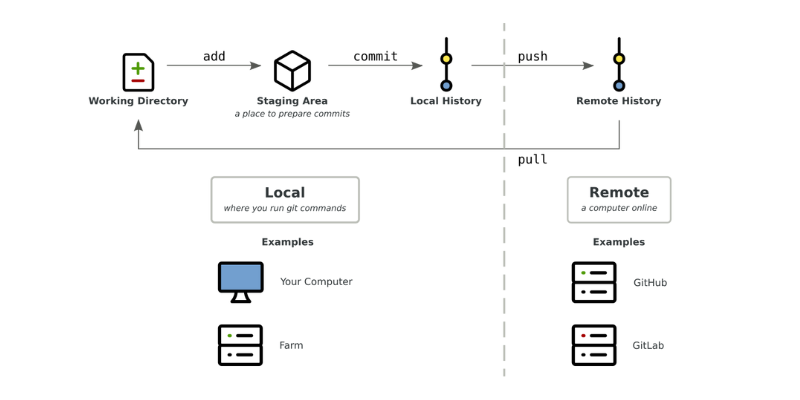
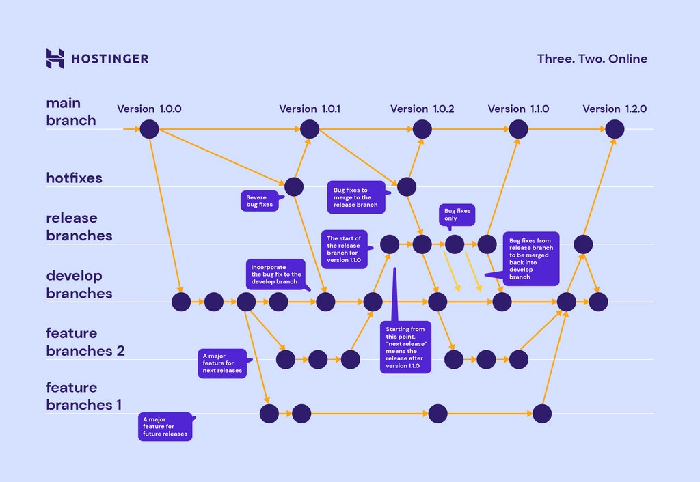

# Git and GitHub learning steps and command cheat sheet
## Introduction
#### What is version control?
Version control, also known as source control, is the technique of tracking and managing changes to codes and these are the systems that are software tools that enable software teams to manage modifications to source code as time passes. 

#### Local version control system
While simply copying files into different directories is a common version-control method, it's prone to errors and accidental overwrites. To address this, programmers created local VCSs (version control systems) that store file changes in a database for better management. RCS is a popular local VCS that stores file changes as patches, allowing for file reconstruction at any point in time.

#### Centralized Version Control Systems
CVCSs address the collaboration issue by storing all files in a central server. This offers control and visibility, but comes with risks:

* Single point of failure: Server downtime prevents work and potential data loss.
* Data loss threat: Corrupted server disk or improper backups can erase project history.
* Similar to local VCSs: Both risk losing everything if the history is kept in one place.

While CVCSs provide advantages, their central server dependency creates significant vulnerabilities.


#### What is Git?
**Git is the free and open-source distributed version control systems that’s responsible for everything GitHub related that happens locally on your computer.**
**It is a Distributed Version Control System (DVCS) that stands out for its unique approach to data storage and management.**
**Linus Torvalds, the developer of the Linux kernel, created Git in 2005 to help control the Linux kernel's development.**

**Key points:**

- **Distinctive Approach:** Git's way of storing and managing information differs significantly from other VCSs like CVS, Subversion, or Perforce.
- **Clear Understanding Required:** Grasping Git's fundamentals will significantly ease its effective use.
- **Unlearning Previous Assumptions:** Setting aside knowledge of other VCSs is crucial to avoid confusion, as Git's distinct approach might lead to misunderstandings if viewed through the lens of other systems.
- **UI Similarities, Conceptual Differences:** While Git's user interface shares resemblances with other VCSs, its underlying concepts and data handling are unique.
- **History Tracking:** Git allows you to track every change made in your project, including: who made the change and when it was made. 
- **Collaboration:** Multiple developers can be able work on the same project at the same time, and Git efficiently manages the merging of changes in code. 
- **Branching and Merging:** Git enables developers to create branches to work on new features or bug fixes and later merge them back into the main codebase. 
- **Offline Work:** Git works offline, which means you can commit changes and work on your project even without an internet connection. 

**Understanding Git's unique approach is essential for smooth and effective use.**

#### What is a Distributed Version Control System?
A distributed version control system is a system that helps you keep track of changes you've made to files in your project.
This change history lives on your local machine and lets you revert to a previous version of your project with ease in case something goes wrong.
Git makes collaboration easy. Everyone on the team can keep a full backup of the repositories they're working on on their local machine. Then, thanks to an external server like BitBucket, GitHub or GitLab, they can safely store the repository in a single place.
This way, different members of the team can copy it locally and everyone has a clear overview of all changes made by the whole team.
<br>
Git has many different commands you can use. And I've found that these are the ones I use the most often (and are therefore the most helpful to remember).
So I have written them down and thought it'd be nice to share them with the community. I hope you find them useful – Enjoy.

#### What is GitHub?
**GitHub is a widely-used Free-to-use cloud Storage platform with version control and many other essential features that specifically helps developers to manage and deploy their projects on GitHub.**
<br><br>

## Installation step:

if you are new user we to install git bash for windows, and for mac user first we have to install and find terminal then install git,

### 1. Instalation Guide:
Download git installer for windows or mac or linux from this [link](https://git-scm.com/downloads),

Here's an expanded guide for installing Git on different Linux distributions:

##### A. Universal Method:

* After download the source code: Visit the Git download page at this [link](https://git-scm.com/book/en/v2/Getting-Started-Installing-Git) and choose the desired version. Download the source tarball (.tar.gz) file.

* Extract the source code: Open a terminal in your preferred location and use tar -xf <filename>.tar.gz to extract the downloaded file.

* Configure and build Git: Navigate to the extracted directory and run ./configure. This checks your system for necessary dependencies. Install any missing dependencies via your package manager. Then, run make to build Git.

* Install Git: Execute sudo make install to install Git system-wide. This requires administrator privileges.

##### B. Distro-Specific Methods:

* Debian/Ubuntu: Use the package manager with 
```sudo apt install git```
* Fedora/CentOS: Use the package manager with 
```sudo dnf install git```
* Arch Linux: Install Git from the official repository with 
```sudo pacman -S git```
* OpenSUSE: Use the package manager with 
```sudo zypper install git```
* Gentoo Linux: Install Git from the Gentoo portage with 
```sudo emerge dev-vcs/git```


### 2. Verify Installation:

Once the installation completes or to check git in any pc or laptop, confirm it by checking the Git version ```git --version``` or only use command ```git```

**Display the main help documentation, showing a list of commonly used Git commands.**
```git help``` or ```git help <command>```

<br><br>
## Git Configuration & Setup

The command below returns a list of information about your git configuration including user name and email:
```git config -l```
**setup your Git username:**
With the command below you can configure your user name:
git config --global user.name "username"

**setup your Git user email:**
This command lets you setup the user email address you'll use in your commits.
`git config --global user.email "<githubemailid>"`
**to recheck above config**
This command give us information about username or email or default branch name etc.
`git config --get "<desire information>"`
** to use default remote name**
`git config --global alias.push 'push origin'`

<br><br>
## Start a working with git

### Local repo creating
1. make a folder in your hard drive locally
2. go to that folder via command prompt or terminal`cd <pathtofolder>`

### remote repo creating
1. got to repositories in profile
2. click new to creat new repo 

**Initializing a Repository**
 **Here's the Markdown table for the Git commands:**

| Command | Description |
|---|:---|
| `git init` | Initializes a new Git repository in the current directory. |
| `git init <directory path>` | Creates a new Git repository in the specified directory. |
| `git clone <repository_url>` | Clones a repository from a remote server to your local machine. |
| `git clone --branch <branch_name> <repository_url>` | Clones a specific branch from a repository. |
| `git remote`| List all remote repositories.|
|`git remote add "<remotename>" "<github_repo_url>"`| Add a git URL and remote name(by defualt origin is use as remote name)|
|`git remote -v`| Verfy remote information |

**Here's the Markdown table for the basic Git commands you provided:**

| Command | Description |
|---|:---|
| `git add <file>` | Adds a specific file to the staging area. |
| `git add .` or `git add --all` | Adds all modified and new files to the staging area. |
| `git status` | Shows the current state of your repository, including tracked and untracked files, modified files, and branch information. |
| `git commit` | Creates a new commit with the changes in the staging area and opens the default text editor for adding a commit message. |
| `git commit -m "<message>"` or `git commit --message "<message>"` | Creates a new commit with the changes in the staging area and specifies the commit message inline. |
| `git commit -am "<message>"` or `git commit --all --message "<message>"` | Commits all modified and deleted files in the repository without explicitly using `git add` to stage the changes. |
| `git reset <file>` or `git reset` | Reset file in the working directory to its unstage area. |
| `git reset <commit_id>` | Moves the branch pointer to a specified commit, resetting the staging area and the working directory to match the specified commit. |
| `git reset --hard <commit_id>` | Moves the branch pointer to a specified commit, discarding all changes in the staging area and the working directory, effectively resetting the repository to the specified commit. |
| `git rm <file>` | Removes a file from both the working directory and the repository, staging the deletion. |
| `git mv` | Moves or renames a file or directory in your Git repository. |
|`git log`|Displays the commit history of the current branch.|
|`git log –all`|Displays the commit history of all branches.|

<br><br>

**This is file life-cycle on local repo**

<br><br><br><br>

**This is work-flow image on local to remote repo**

<br><br>

**Branching and Merging**
**Here are some Git branching and merging commands:**

| Command                       | Description                                                                       |
|-------------------------------|:-----------------------------------------------------------------------------------|
| `git branch`                  | Lists all branches in the repository.                                               |
| `git branch <branch-name>`    | Creates a new branch with the specified name on current branch.                                      |
| `git branch -d <branch-name>` | Deletes the specified branch.                                                       |
| `git branch -a`               | Lists all local and remote branches.                                               |
| `git switch <branch-name>`    | Switches to the specified  branches.                                                         |
| `git checkout <branch-name>`  | Switches to the specified branch.                                                  |
| `git checkout -b <new-branch-name>` | Creates a new branch and switches to it.                                             |
| `git merge <branch>`           | Merges the specified branch into the current branch.                                 |
| `git log`                     | Displays the commit history of the current branch.                                  |
| `git log <branch-name>`       | Displays the commit history of the specified branch.                                 |
| `git log --all`               | Displays the commit history of all branches.                                       |
| `git diff` | Shows the changes between the working directory and the staging area (index). |
| `git diff <commit1> <commit2>` | Displays the differences between two commits. |

**This is how branches are managed on git**

<br><br>

**Remote Repositories**
**Here are some Git remote repositories commands:**

| Command                 | Description                                                                                                  |
|-------------------------|:--------------------------------------------------------------------------------------------------------------|
| `git fetch`              | Retrieves changes from a remote repository, including new branches and commits.                          |
| `git pull`               | Fetches changes from the remote repository and merges them into the current branch.                         |
| `git pull <remote>`      | Fetches changes from the specified remote repository and merges them into the current branch.                |
| `git push`               | Pushes local commits to the remote repository.                                                             |
| `git push <remote>`      | Pushes local commits to the specified remote repository.                                                   |
| `git push <remote> <branch>` | Pushes local commits to the specified branch of the remote repository.                                     |
| `git push --all`         | Pushes all branches to the remote repository.                                                                |